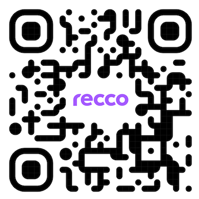

# Recco Android SDK

This repository holds the codebase for the Recco Android SDK. Instructions on how to add and use this Android library can be found in the [Usage](#usage) section.

You are more than welcome to install the [APK](#demo) to start playing around with the product, or clone the repository and compile it on your own if you feel like it. However, please be aware that in order to actually integrate it into your own application, you will first need to contact our sales team to initiate the license acquisition process.

## Overview

Personalized, and user-friendly approach to health and wellness recommendations based on users' unique interests, motivations, and health behaviors. Whether they are looking to improve their fitness, manage their stress, or simply lead a more fulfilling life. __`Recco` is designed to help them reach their full potential.__

_We believe that everyone deserves to live their best life, and we are committed to making that vision a reality through our cutting-edge technology and unwavering dedication to scientific accuracy._

## Mission

Allow experiencing firsthand the effectiveness of our `recommendation engine`. Empower users to achieve their best selves through personalized recommendations that are grounded in the latest scientific research.

Enabling products to provide their users with a wealth of knowledge, tips, and exercises to help them improve their behavior and achieve their goals.

|                                      |                                      |                                       |
|--------------------------------------|--------------------------------------|---------------------------------------|
|  |  |  |


## Key features

__Keeping it simple__

We believe in open communication and encourage individuals to take ownership and responsibility for their actions. We reject the notion of blame culture and instead embrace collaboration, recognizing that we are stronger together. Let us extend a helping hand to one another as we work towards achieving our common goals.

__Seamless integration__

This product has a special focus on working smoothly with existing products. With very few steps Recco can be configured and fully operational.

__Technological trend__

Recco aims to be in line with modern solutions and development trends, best practices and official guidelines are followed to keep quality at is highest level.

__Analytics & Reporting__

Monitor the utilization and impact of the recommendation engine. You can track key metrics like user engagement, satisfaction levels, and health outcomes to evaluate the effectiveness of our solution.

__Personalized content__

Our engine learns to recommend the user content for each topic that the user motivate to improve their health behavior. The recommendations will change on the path of the user and will recommend always the content which the user helps to go forward in the specific time.

## Setup

__Recco__ can be integrated and be part of your product the whole product experience, is brought in the shape of a a __full user interactive journey__ having all features included.

Following this approach, integration brings access to services in which the UI solution leans, so consumers can develop __their own experiences__.

To be able to work with Recco, some artifacts are needed to be downloaded, to do so:

- [Github Packages][Github-Packages] configuration is needed. Check [Personal Access Token][PAT] section in order to provide a set of valid credentials.

- Configure your gradle.properties file under ~/.gradle/ folder

```groovy
gprUser=your-github-user-here
gprKey=your-github-key-here
```

- In order to sync artifacts previously published in Github Packages repository, you need to add the following configuration. Inside settings.gradle.kt file.

```kotlin
repositories {
  ...
  maven {
    name = "GithubPackages"
    url = uri("https://maven.pkg.github.com/sf-recco/android-sdk")
    credentials {
      username = extra["gprUser"].toString()
      password = extra["gprKey"].toString()
    }
  }
}
```

Then, include the dependency in your module level build.gradle file and sync again.

```kotlin
  // UI 
  implementation("com.significo:recco-api-ui:<release-version>")
```

## Releases

Our [CHANGELOG.md](./CHANGELOG.md) contains all releases information.

All artifacts are available in [Github][Github-Recco].

## Usage

This section aims to explain how Recco integration in Android projects is accomplished. Make sure, you also check out [Flutter][Recco-Flutter] and [iOS][Recco-iOS] counterparts !

You will find a more detailed implementation example and a full UI journey explanation in the [Showcase][Recco-Showcase] document.

### Demo

Would you like to experience the Showcase application directly in your device ?

Go ahead ! Feel free to install it using the following [download link][Recco-Download].

You can even read the following QR Code.

<p align="center" width="100%">
  
</p>

### Api summary

| Method              | Description                                                   |
|---------------------|---------------------------------------------------------------|
| init                | Configures Recco given an application name and and apiSecret. |
| login               | Performs login operation given a user identifier.             |
| logout              | Performs logout operation.                                    |
| navigateToDashboard | Launches Recco's full experience journey.                     |

#### init

| Param       | Type        | Optional | Description                                                                               |
|-------------|-------------|----------|-------------------------------------------------------------------------------------------|
| sdkConfig   | ReccoConfig | NO       | Recco configuration object made from an application name, secret key and a color palette. |
| application | Application | NO       | Android application context.                                                              |
| logger      | ReccoLogger | YES      | Allows configuring a logger instance to trigger debug and error log ops.                  |

```kotlin
// Annotate your Application entry point using Hilt
@HiltAndroidApp
class YourApplication : Application() {

    override fun onCreate() {
        super.onCreate()

        //...
        //...

        ReccoApiUI.init(
            // SDK Config
            sdkConfig = ReccoConfig(
                appName = "APP NAME HERE",
                apiSecret = "API SECRET HERE",
                palette = ReccoPalette.Fresh,
            ),

            application = this,

            // This is a logger implementation example, you can provide your own !
            logger = DefaultReccoLogger()
        )
    }
}
```

Please, take a look on the Recco Showcase application [documentation][Recco-Showcase] so you can get more information on __Recco Color Palettes__.

__Bonus:__ How to provide your own ReccoLogger implementation ?

```kotlin
object : ReccoLogger {
    override fun e(e: Throwable, tag: String?, message: String?) {
        // Your error logging operation here
    }

    override fun d(message: String, tag: String?) {
        // Your debug logging operation here
    }
}
```

#### login

| Param  | Type   | Optional | Description                                                         |
|--------|--------|----------|---------------------------------------------------------------------|
| userId | String | NO       | User to be consuming the SDK and to be creating its own experience. |

```kotlin
// Button OnClick action login implementation sample
@Composable private fun login() {

    Button( // Button config here ),
        // ...

        onClick = {

            ReccoApiUI.login(userId = textField)

            // Useful point to store user data
        }
    ) {
        Text(text = "Login")
    }
}
```

#### logout

```kotlin
// Button OnClick action logout implementation sample
@Composable private fun logout() {

    Button( // Button config here ),
        // ...

        onClick = {

            ReccoApiUI.logout()

            // Useful point to clear stored data if any
        }
    ) {
        Text(text = "Logout")
    }
}
```

#### navigateToDashboard

| Param   | Type    | Optional | Description      |
|---------|---------|----------|------------------|
| context | Context | NO       | Android context. |

```kotlin
// Button OnClick action navigateToDashboard implementation sample
@Composable private fun openReccoExperience() {

    Button( // Button config here ),
        // ...

        onClick = {

            ReccoApiUI.navigateToDashboard(this@MyActivity)
        }
    ) {
        Text(text = "Open Recco")
    }
}
```

[Github-Packages]:https://github.com/features/packages
[PAT]:https://docs.github.com/en/authentication/keeping-your-account-and-data-secure/managing-your-personal-access-tokens
[Github-Recco]:https://github.com/orgs/viluahealthcare/packages?repo_name=recco-android-sdk
[Recco-Flutter]:https://github.com/sf-recco/flutter-showcase
[Recco-iOS]:https://github.com/viluahealthcare/recco-ios-sdk
[Recco-Showcase]:./docs/SHOWCASE.md
[Recco-Download]:https://app.bitrise.io/app/2e7050f9-468b-45b6-8ab9-73124007335f/build/f0cf8235-ee29-43e6-a000-7c0c7e940dd2/artifact/af27994c0df5cfbc/p/633b6a2f0ea55095050e5dab7b285bd7
[Recco-QR]:./art/recco_qr.png
