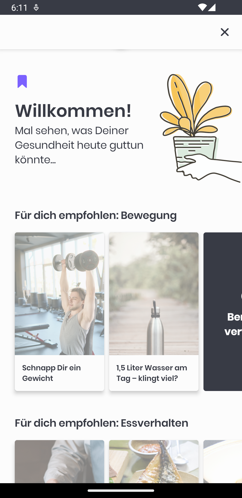

# SHOWCASE

This document aims to guide the consumers through all UI's module features, so they can get a deeper understanding about
the power that this integration brings and how important little details sometimes are.

## Login

You need your users to be identified, this is how a personalized experience is built.

| Login                                 | Login Filled                                      | Welcome                                    |
|---------------------------------------|---------------------------------------------------|--------------------------------------------|
|  |  |  |

## Palette selection

Recco's journey design might be configured using one of its predefined palettes, available in both light and dark modes.

| Select Palette                                | Apply Palette                                | Apply Dark Palette                              |
|-----------------------------------------------|----------------------------------------------|-------------------------------------------------|
|  |  |  |

## Language Selection

Recco currently supports English and German languages, let your users select their regarding their preferences.

| Select Language                               | Apply English                               | Apply German                              |
|-----------------------------------------------|---------------------------------------------|-------------------------------------------|
|  |  |  |

## Onboarding

Tell your users what this Recco thing is about before interacting with them. Some _warm up_ screens 
are provided so the user starts tasting the look & feel and learns briefly on the product.

| Onboarding First                                | Onboarding Second                                 | Onboarding Third                                |
|-------------------------------------------------|---------------------------------------------------|-------------------------------------------------|
|  |  |  |

## Questionnaire

It is important, from the `Recommendation Engine` point of view, to have some knowledge about users.
This way, first interaction will show accurate content based on the information provided.

| Onboarding Questionnaire                                   | Onboarding Second                                            | Onboarding Outro                                  |
|------------------------------------------------------------|--------------------------------------------------------------|---------------------------------------------------|
|  |  |  |

## Feed

Curated content recommended to the user, this content is live and will change on each user interaction.

It is crucial to encourage users to take advantage from the IA, since it will be learning on every interaction.

| Feed Init Loading                                   | Feed Loading Shades                                 | Feed Loaded                                   |
|-----------------------------------------------------|-----------------------------------------------------|-----------------------------------------------|
|  |  |  |

## Article

Health and wellness recommendations, the core of the application itself that empower users to achieve their best selves.

| Article                              | Article Rating                                  | Article Bookmarking                                      |
|--------------------------------------|-------------------------------------------------|----------------------------------------------------------|
|  |  |  |

## Bookmarking

Allows users to keep track of all their interests, and store content for later reading.

| Bookmark Empty                                | Bookmark Content                                       | Bookmark interaction                                    |
|-----------------------------------------------|--------------------------------------------------------|---------------------------------------------------------|
|  |  |  |

## Feed Locked content

Content should be presented wisely. To do so, user interactions are needed and more information is 
likely to be required before some information is given to the user. This leads to a leveled-up, achievements
and progressive experience.

| Feed Scroll                                    | Feed Locked                                  | Feed Unlock                                           |
|------------------------------------------------|----------------------------------------------|-------------------------------------------------------|
|  |  |  |

## Feed Unlocking Content

Provides user engagement while promoting IA interactions. Content on interesting topics for the user
will be unlocked just by asking simple questionnaires that will fit the experience to their needs.

| Feed Question First                                             | Feed Question Last                                    | Unlock interaction                                 |
|-----------------------------------------------------------------|-------------------------------------------------------|----------------------------------------------------|
|  |  |  |

